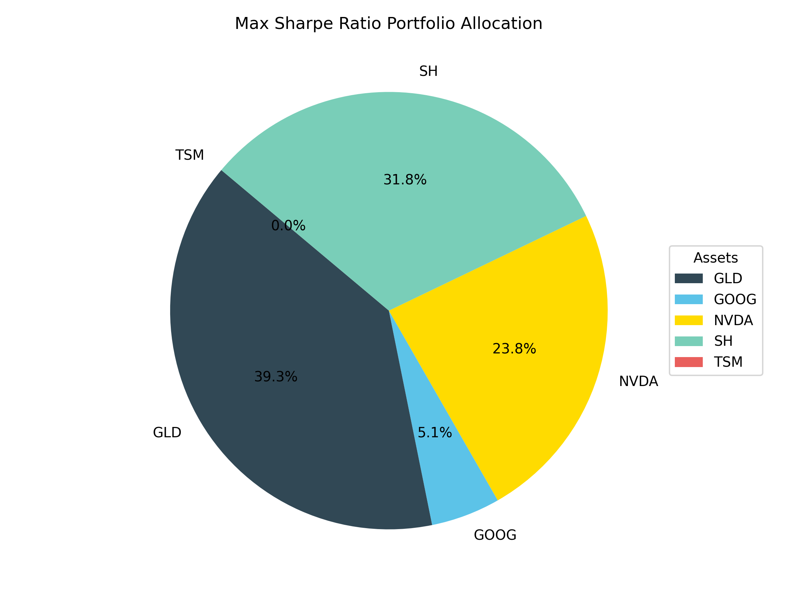
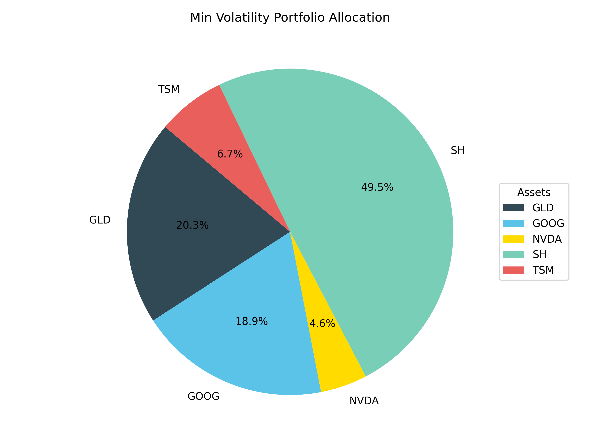
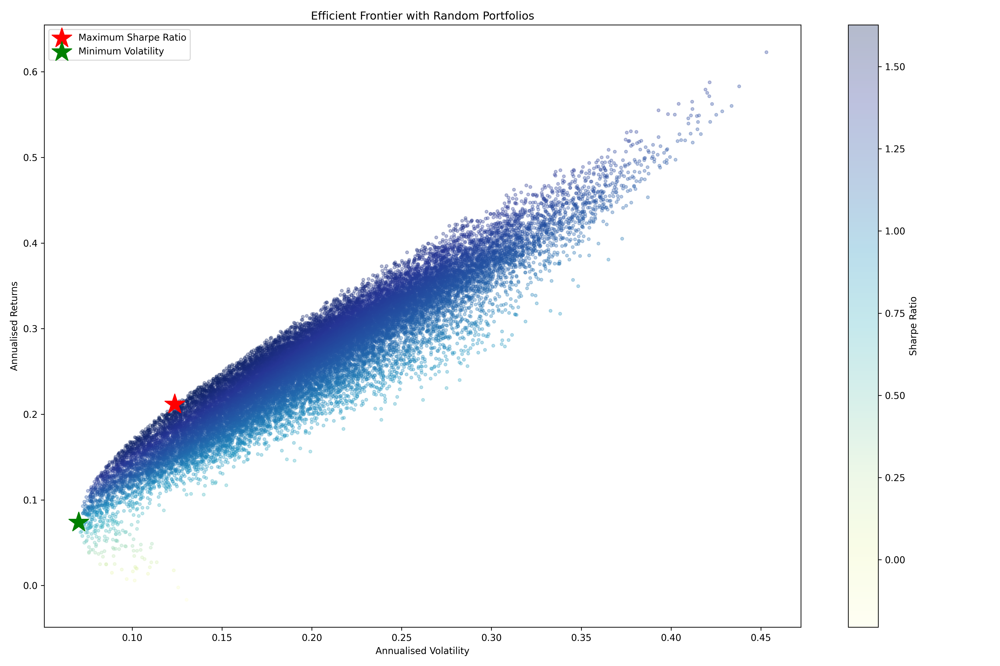
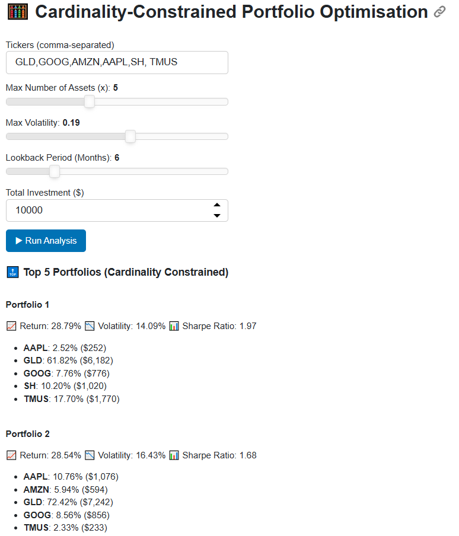

# 📈 Portfolio Optimization Demo

This repository demonstrates a constraint-based portfolio optimization engine with full CI/CD automation.  
It supports both **Sharpe Ratio Maximization** and **Minimum Volatility Allocation**, with results visualized daily and published to a cloud dashboard.

> This is a **public demo repository** — the full codebase is kept private.  
> Contact me directly if you wish to discuss implementation details.

---

## 🚀 Features

- Constraint-based optimizer using `cvxpy`
- Supports max-Sharpe and min-volatility strategies
- Custom asset bounds, turnover control, and flexible constraints
- Efficient frontier visualization with random portfolios
- Daily CI/CD pipeline via GitHub Actions
- Cloud dashboard auto-deployment (Render.com)

---

## 🧱 System Pipeline
```
Edit tickers.json → GitHub Sync → GitHub Actions (00:00 UTC)
   ⬇
Run Optimizer + Generate Visuals
   ⬇
Render Dashboard Auto-Update
```

---

## 🔄 Extended System Workflow (Google Drive + GitHub)

```
Google Drive Desktop (models, features, scaler)
        │
        ▼ (Sync)
Google Drive
        │
        ├────────────► GitHub Repo
        │                 ▲
        │                 │
        │          (Modify via VS Code)
        │                 │
        └──── VS Code ────┘

GitHub Repo
    │
    ▼ (00:00 UTC Daily)
GitHub Actions
    │
    ▼
Render.com (Auto Display Latest Info)
```

---

## 📊 Demo Outputs

### 🔹 1. Max Sharpe Allocation  


### 🔹 2. Min Volatility Allocation  


### 🔹 3. Efficient Frontier  


---

## 💻 Live Dashboard UI Preview

> Cardinality-Constrained Portfolio Optimisation Panel (Deployed via Render)



---

## 📁 Sample Allocation Files

- [`max_sharpe_allocation.csv`](./Output/max_sharpe_allocation.csv)
- [`min_vol_allocation.csv`](./Output/min_vol_allocation.csv)

These files include daily asset weights generated by the optimizer.

---

## ⚙️ Automation Flow (CI/CD)

1. GitHub Actions runs optimization script daily (00:00 UTC)  
2. Portfolio data fetched and cleaned  
3. Optimized weights calculated (Sharpe / Vol)  
4. Visuals and CSVs exported to `/Output/`  
5. Dashboard auto-deployed via Render  

---

## 🧠 Code Snippets (Illustrative Only)

> The full source code is private. Below are simplified illustrative examples.

### 🔸 `tickers.json`

```json
{
  "tickers": ["GLD", "GOOG", "AMZN", "AAPL", "SH", "TMUS"],
  "max_assets": 5,
  "max_volatility": 0.20,
  "lookback_months": 6,
  "investment": 10000
}
```

### 🔸 `cvxpy` Optimizer Snippet

```python
import cvxpy as cp
import numpy as np

n = len(mu)  # number of assets
w = cp.Variable(n)  # asset weights

ret = mu @ w
risk = cp.quad_form(w, cov_matrix)

# Maximize Sharpe Ratio (risk-adjusted return)
objective = cp.Maximize((ret - risk_free_rate) / cp.sqrt(risk))
constraints = [
    cp.sum(w) == 1,
    w >= 0,
    w <= max_weight,
]

problem = cp.Problem(objective, constraints)
problem.solve()
```

---

## 📎 Contact

For collaboration or to request more details:

**Kai Yeh**  
Email: KaiYeh820206@gmail.com  
GitHub: [WayneKaiYeh](https://github.com/WayneKaiYeh)

---

## 📄 License

This repository is shared under the [**Creative Commons BY-NC-ND 4.0 License**](https://creativecommons.org/licenses/by-nc-nd/4.0/).

- ❌ No commercial use  
- ❌ No derivatives or redistribution  
- ✅ Attribution required  

All rights to the full code and pipeline logic are reserved.
